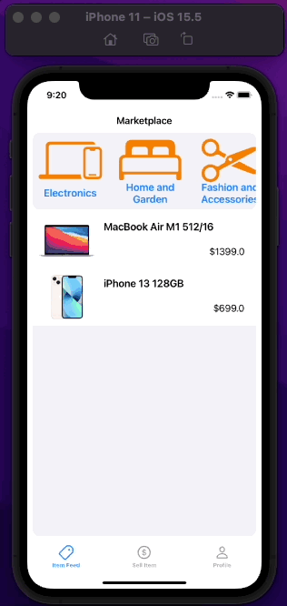
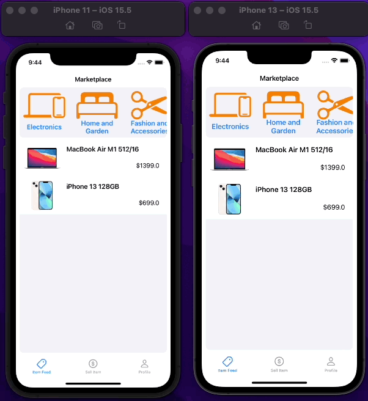
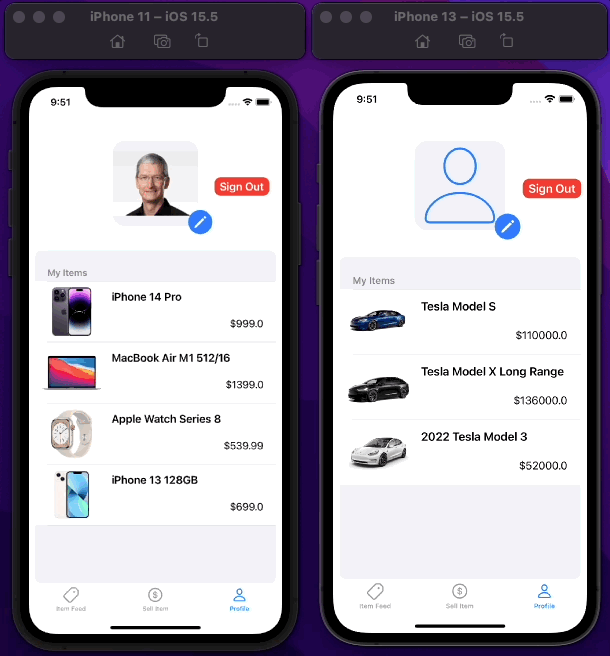
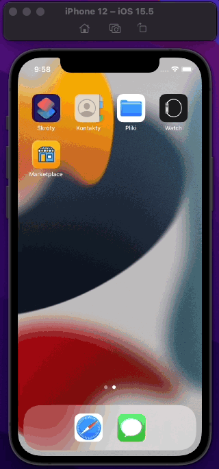
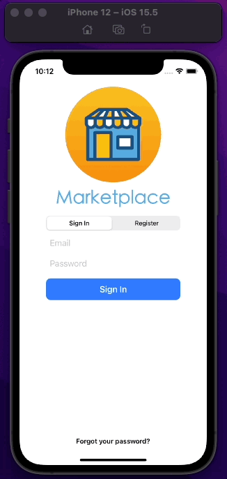
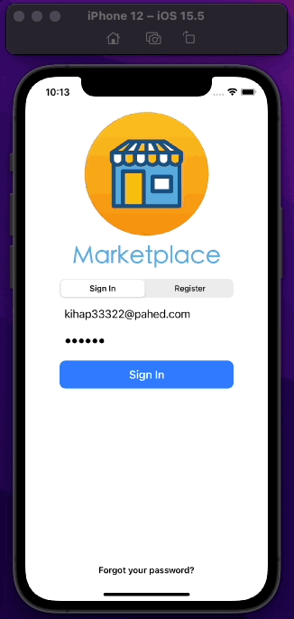

# Marketplace

UIKit iOS App for buying/selling items

## Runtime environment
   

## Technologies
-   UIKit
-   MVVM Architecture
-   Firebase
-   SnapKit

## Table of contents

* [App Features](#app-features)
* [How to build](#how-to-build)
* [Demo](#demo)

## App Features

- 	user can create a new account 
- 	user can sign in
-   user can sign out
- 	user can reset password
- 	user can create an item
-   user can delete only their created item
- 	user can view an item
-   user can change profile photo
- 	app stores user profile photo
- 	app stores item photos
- 	user can filter for a specific category of items

## How to build
After downloading this repo, you can run the project `Marketplace.xcworkspace`

## Demo
### Browsing items

### Adding an item

### Setting a profile photo and deleting items

### Signing in and out, registering and resetting password

